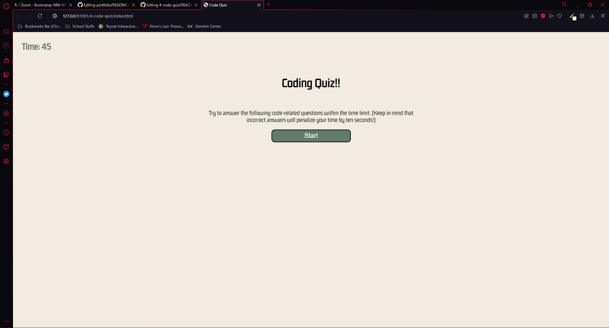

# 04 Web APIs: Code Quiz

## Creating a functinoal code quiz

## User Story

```
AS A coding boot camp student
I WANT to take a timed quiz on JavaScript fundamentals that stores high scores
SO THAT I can gauge my progress compared to my peers
```

## Acceptance Criteria

```
GIVEN I am taking a code quiz
WHEN I click the start button
THEN a timer starts and I am presented with a question
WHEN I answer a question
THEN I am presented with another question
WHEN I answer a question incorrectly
THEN time is subtracted from the clock
WHEN all questions are answered or the timer reaches 0
THEN the game is over
WHEN the game is over
THEN I can save my initials and my score
```
## Usage

When you click on the start button at the center of the screen, you will see the timer begin counting down from 45 and aquestion will appear. When you answer the question, you will either see an alert that tells you that your answer was correct of incorrect, then you will be presented with another question. If the answer is incorrect, you wkll lose 10 seconds from the timer. Once the questions are all answered or the timer reaches 0, the game is over and you will be presented with an option to enter your intials to save your score.

## Screenshot



## Deployed Page

The webpage has been deployed at: https://bobascript.github.io/4-code-quiz/
